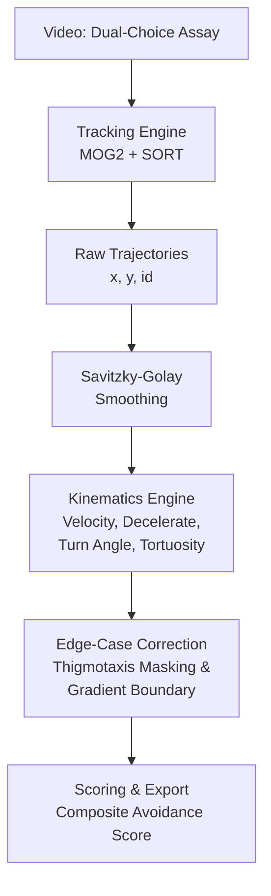

# Kinematic Insect Hesitation Tracking

> **Early-onset pesticide resistance detection through classical computer vision and kinematics.**

[](https://github.com/adityansumohapatra-dev/insect-resistance/actions)
[](https://opensource.org/licenses/MIT)
[](https://www.python.org/downloads/)

## Background & Problem

Entomology literature distinguishes between two forms of pesticide resistance: **physiological resistance** (the insect biochemically survives a lethal dose) and **behavioral resistance** (the insect alters its behavior to avoid the chemical entirely). Behavioral resistance is further classified into *stimulus-independent* (innate avoidance of certain habitats) and *stimulus-dependent* (avoidance triggered by actively sensing a noxious chemical) forms [1]. 

Standard pesticide screening tools—like Y-tube olfactometers or 24-hour survival bioassays—capture binary "survive/die" or "choice A/choice B" outcomes. They are completely blind to the microscopic *hesitation* and *deceleration* behaviors that characterize stimulus-dependent avoidance. Consequently, there is genuine debate in the literature about whether "behavioral resistance" has been rigorously quantified or merely anecdotally observed [2].

While commercial animal-tracking software (e.g., Noldus EthoVision) exists and can measure general velocity and turning angles, these solutions are closed-source, prohibitively expensive for many labs, and lack domain-specific corrections (like chemical gradient mapping). 

This project introduces a novel, open-source pipeline applied to the established **dual-choice leaf-disc assay**. It extracts auditable, per-frame kinematic metrics (velocity, deceleration, turning angle, tortuosity) to quantify behavioral resistance mathematically.

## Why No Deep Learning?

This project operates under a strict engineering constraint: **no deep learning or trained neural networks.**

Everything is built on classical computer vision (OpenCV's `MOG2` background subtraction, Kalman Filter + SORT tracking) and closed-form kinematics math. This ensures that the system is not a "black box." When a researcher claims an insect avoided a pesticide, every number contributing to that claim—from raw pixels to the final composite avoidance score—is fully auditable, reproducible, and explainable through basic physics.

## How It Works



## Key Features

- **No Deep Learning**: Fully auditable, classical CV pipeline.
- **Synthetic Ground-Truth Validation**: The math is proven against a synthesized, noise-injected biased random walk *before* touching real video.
- **Dead-Zone Thigmotaxis Correction**: Automatically masks out arena edges to prevent natural wall-hugging from inflating hesitation scores.
- **Gradient-Aware Chemical Boundary**: Models the pesticide as a continuous Gaussian decay field rather than a rigid binary line.
- **Per-Frame Auditability**: Every computational stage exports independently inspectable CSVs.

## Demo

The repository includes a 60-second visual demonstration script (`demo.py`) highlighting the tracking and math separation.

- **`demo_output/beat2_trajectories.png`**: Shows the raw trajectories (Resistant vs. Susceptible) overlaid on the dual-choice arena.
- **`demo_output/beat3_separation.png`**: Shows the final quantified avoidance score separation between phenotypes.
- **`demo_output/beat4_smoothing.png`**: Visualizes the Savitzky-Golay signal recovery against raw camera jitter.
- **`demo_output/beat5_deadzone.png`**: Demonstrates the dynamic exclusion of thigmotaxis (wall-hugging) behavior.

## Installation

Requires Python 3.10+.

```bash
git clone https://github.com/[username]/insect-resistance.git
cd insect-resistance
python -m venv venv

# Windows
venv\Scripts\activate
# macOS/Linux
source venv/bin/activate

pip install -r requirements.txt
```

## Quickstart

**1. Generate Synthetic Data**
Creates a fake dataset (with camera jitter and occlusions) to test the math.
```bash
python -m insect_resistance.synthetic_insect_data_generator --out ./data
```

**2. Run Pipeline Validation**
Proves the math can separate resistant vs. susceptible behavior using the ground truth.
```bash
python -m insect_resistance.validate
```

**3. Run the Full CLI on a Trial**
Generates per-frame kinematics and a markdown report from a trajectory file.
```bash
python -m insect_resistance.cli --csv data/synthetic_trajectory.csv --json data/synthetic_metadata.json --outdir my_results
```

**4. Run the Visual Demo**
Populates the `demo_output/` folder with polished publication-quality graphs.
```bash
python demo.py
```

## Project Structure

```text
.
├── insect_resistance/
│   ├── __init__.py
│   ├── synthetic_insect_data_generator.py  # Synthesizes biased random walks with gradient aversion
│   ├── kinematics.py                       # Velocity, turning angle, deceleration, and tortuosity math
│   ├── edge_cases.py                       # Thigmotaxis masking and Gaussian gradient mapping
│   ├── tracking.py                         # OpenCV MOG2 background subtraction + SORT tracking
│   ├── validate.py                         # Ground-truth validation harness
│   ├── cli.py                              # Entry point for scoring recorded data
│   └── tests/                              # Unit tests covering core kinematics math
├── docs/
│   └── METHODOLOGY.md                      # Detailed breakdown of equations and formulas
├── demo.py                                 # Orchestration script for visual presentation
├── DEMO_SCRIPT_NOTES.md                    # Cue sheet for screen-recording the demo
├── requirements.txt
└── pyproject.toml
```

## Validation Results

Before relying on the tracker, the `validate.py` harness confirms:
1. **Signal Recovery (Smoothing):** Savitzky-Golay filters recover the ground-truth path from injected camera pixel-jitter (reducing residual error to <2.0px).
2. **Phenotype Separation:** The kinematics engine successfully separates "resistant" from "susceptible" insects (yielding a >1.5x effect size in the composite avoidance score), proving the mathematical logic works independently of computer vision noise.

## Roadmap

- [x] **Phase 1:** Synthetic data generator (biased random walk, gradient-aware, camera noise).
- [x] **Phase 2:** Kinematics engine (velocity, deceleration, turning angle, tortuosity).
- [x] **Phase 3:** Edge-case correction (dead-zone + gradient-boundary logic).
- [x] **Phase 4:** OpenCV tracking pipeline (MOG2 + SORT).
- [x] **Phase 5:** End-to-end synthetic validation harness.
- [x] **Phase 6:** Scoring CLI and reporting export.

## Limitations & Honest Caveats

- **Synthetic-Only Validation**: The current baseline accuracy is validated against synthetic correlated-random-walk models. Real insect biomechanics are more complex.
- **Model Approximations**: The correlated-random-walk model is an approximation of real insect movement; extreme lighting conditions in real video may challenge the MOG2 background subtractor.
- **Not a Regulatory Tool**: This is a research and screening aid, not a clinical or regulatory diagnostic tool for definitive agricultural resistance declarations.

## References

1. Sparks, T. C., et al. (1989). "Pesticide Resistance." *[citation needed for specific behavioral resistance review]*
2. Georghiou, G. P. (1972). "The Evolution of Resistance to Pesticides." *Annual Review of Ecology and Systematics*.
3. Kareiva, P., & Shigesada, N. (1983). "Analyzing insect movement as a correlated random walk." *Oecologia*, 56(2-3), 234-238.
4. Benhamou, S. (2004). "How to reliably estimate the tortuosity of an animal's path." *Journal of Theoretical Biology*, 229(2), 209-220.

## Contributing

Please see [CONTRIBUTING.md](CONTRIBUTING.md) for details on our code of conduct, pull request process, and coding style expectations.

## License

This project is licensed under the MIT License - see the [LICENSE](LICENSE) file for details.

## Contact / Author

- **Author**: Adityansu Mohapatra
- **LinkedIn**: [\[Your LinkedIn URL\]](https://www.linkedin.com/in/adityansu-mohapatra-307813276/?isSelfProfile=true)
- **Email**: adityansumohapatra@gmail.com
